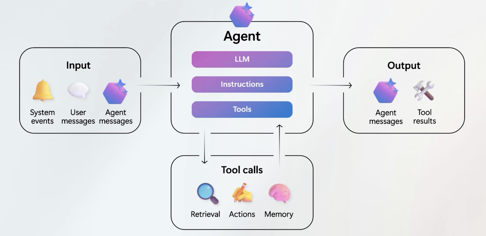

+++
date = '2026-04-11T09:36:09-03:00'
title = 'Agente básico com Microsoft Agent Framework usando Python'
series = ["Microsoft Agent Framework"]
tags = ["MAF", "Agentes", "IA", "Microsoft", "Python", "Azure AI Foundry"]
+++


Nesse primeiro artigo da série sobre MAF, quero introduzir o conceito de agentes para um melhor entendimento, falar o que significa um agente ser "enterprise ready", e mostrar uma implementação básica de um agente usando Python e Azure AI Foundry.

- [**O que é um agente?**](#o-que-é-um-agente)
- [Enterprise ready](#enterprise-ready)
- [Criação do Agente Básico](#criação-do-agente-básico)
- [Resumo](#resumo)
- [Referências](#referências)

## **O que é um agente?**

Um agente é um sistema que tem a capacidade de receber informações, processá-las e tomar decisões de forma autônoma para atingir um objetivo específico. 
O seu "cérebro" é um modelo de linguagem de grande porte (LLM - Large Language Model em inglês) , que recebe instruções previas de como se comportar, ferramentas que pode usar, e o que deve entregar como resultado.


*Figura 1: Arquitetura de um Agente de IA. Fonte: Canal [The AI Show](https://www.youtube.com/watch?v=VBz5HMYIRI4&t=147s), 2025. Minutagem: 02:27.*


Fazendo uma analogia e uma comparação técnica entre componentes de Arquitetura de Software e IA (Python)

| Conceito | O que é na prática? | Analogia | Comportamento |
| :--- | :--- | :--- | :--- |
| **Função** | Bloco de código `def` que processa dados. | O Tijolo | **Estático:** Faz apenas uma coisa específica sempre que chamada. |
| **API** | Porta de entrada (URL/Endpoint) para integração. | A Porta | **Passivo:** Espera uma requisição para entregar uma resposta. |
| **Workflow** | Sequência lógica e ordenada de passos/tarefas. | Linha de Montagem | **Determinístico:** Segue um trilho fixo e caminhos pré-definidos. |
| **Chatbot** | Interface de texto/voz para interação humana. | O Recepcionista | **Reativo:** Responde ao que o usuário digita em linguagem natural. |
| **Agente AI** | Sistema que usa LLM para tomar decisões e usar ferramentas. | O Gerente | **Autônomo:** Raciocina e decide os passos para atingir um objetivo. |


## Enterprise ready

MAF é considerado "enterprise ready", ou seja, pronto para uso em ambientes corporativos, por ter sido criado com foco em segurança, governança, integração, observabilidade entre outros. E também pela sua integração nativa com o Microsoft Azure em geral, que por si só já é uma plataforma de nuvem largamente utilizada por empresas de todos os portes.

Ele também possui uma integração nativa com o [Azure AI Foundry](https://ai.azure.com), a plataforma atual de criação, desenvolvimento e governança de IA da Microsoft. 


## Criação do Agente Básico

Agora vamos para a mão na massa e criar um agente básico usando Python e utilizando o Azure AI Foundry como plataforma de LLM. 

Vamos partir do pressuposto que já temos uma conta no Azure, e acesso ao Azure AI Foundry.

- Para esse exemplo usamos a plataforma nova do AI Foundry, o ai.azure.com, e não a antiga, que era o Azure OpenAI Service, pois a biblioteca do Foundry dentro do MAF, espera um endpoint no formato novo.
- Se o Azure Foundry não foi criado pela sua conta, certifique-se de ter acesso de _Cognitive Services OpenAI User_ ou _Azure AI Developer_ para conseguir acessar os recursos de LLM.


Primeiro instalamos a biblioteca do MAF para Python:

```bash
pip install agent-framework==1.0.0
```

Após a instalação, importamos as bibliotecas necessárias e criamos uma instância do agente:

```python
from agent_framework.foundry import FoundryChatClient
from azure.identity import AzureCliCredential
```
O `FoundryChatClient` é a classe principal para criar-mos um cliente de conexão com o AI Foundry, e o `AzureCliCredential` é uma classe de credencial que permite autenticar usando as credenciais do Azure CLI.

No nosso caso, vou assumir que antes de rodar o script você ja esta autenticado dentro da azure, usando o comando `az login`, por exemplo.

Após a importações, criamos uma instancia das credenciais e uma do Chat, passando 2 variáveis, o endpoint do projeto no Azure Foundry, e o modelo de LLM que queremos usar.

```python
load_dotenv()

credenciais = (
    AzureCliCredential()
)  # necessario autenticação via Azure CLI para acessar o Azure Foundry. Certifique-se de estar logado usando `az login` no terminal.
cliente_foundry = FoundryChatClient(
    project_endpoint=os.getenv("AZURE_FOUNDRY_PROJECT_ENDPOINT"),
    model=os.getenv("AZURE_FOUNDRY_MODEL"),
    credential=credenciais,
)
```

Veja que estou usando o load_dotenv para carregar as variáveis de ambiente, para isso é necessário instalar o pacote do `python-dotenv`


Uma vez criado e autenticado o cliente, criamos um agente, dando um nome e suas instruções iniciais, ou seja, quais as características principais de comportamento do agente.

```python
agente = cliente_foundry.as_agent(
    name="Agente Básico",
    instructions="Você é um assistente amigável. Mantenha suas respostas breves.",
)
```

Ao final, obtemos o resultado de uma pergunta feita com esse "Agente amigável que responde de forma breve" 

```python
result = await agente.run("Qual é a maior cidade da França?")
print(f"Agente: {result}")

```

**E pronto temos um agente básico, que responde a perguntas de forma breve e amigável!!**

O código completo do agente você pode acessar no meu repositório do GitHub, no link das referências.


## Resumo

Microsoft Agent Framework é um framework muito fácil, versátil e poderoso para criação de agentes de IA, principalmente por sua integração nativa com a Microsoft Azure.

Apesar de seu recém lançamento, versão 1.0, ele já vem comum grande aprendizado de outros frameworks da Microsoft que deve gerar um desenvolvimento de agentes muito robusto.

Se gostou desse artigo, ou caso queira um artigo especifico de criação da plataforma do Azure AI Foundry, comente aqui em baixo.

Do contrário, até o próximo artigo sobre MAF! 


## Referências

- [Repositório do códigos da série de artigos](https://github.com/profrsantana/maf)
- [Repositório do códigos desse artigos](https://github.com/profrsantana/maf/tree/main/agente_basico)
- [Microsoft Agent Framework Learn](https://learn.microsoft.com/en-us/agent-framework/overview/?pivots=programming-language-python)
- [Microsoft Agent Framework GitHub](https://github.com/microsoft/agent-framework)
- [Azure AI Foundry](https://ai.azure.com) 