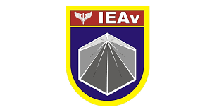
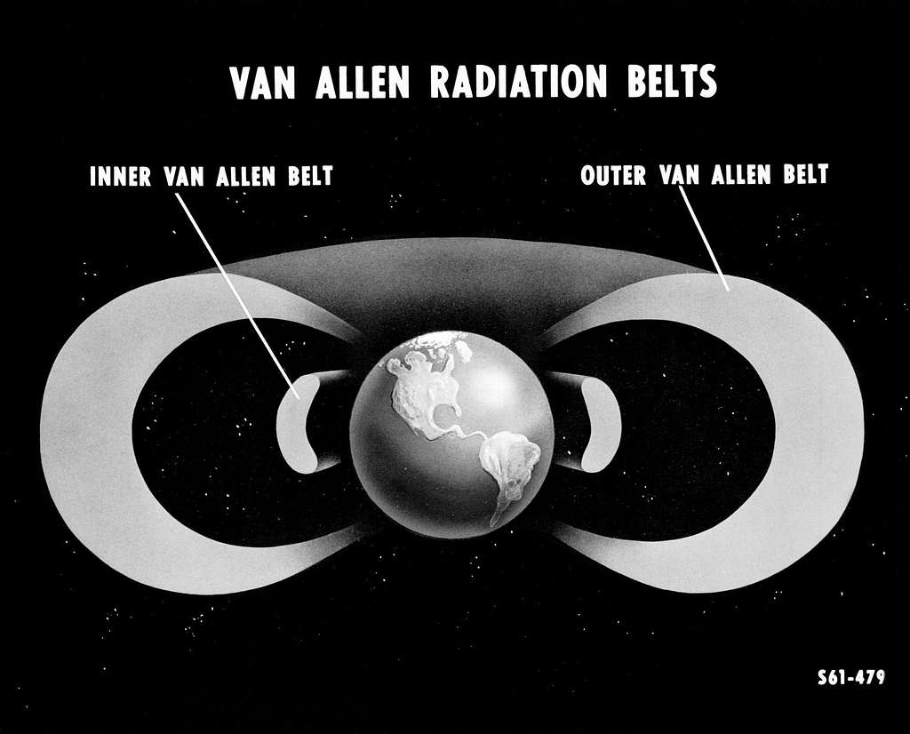
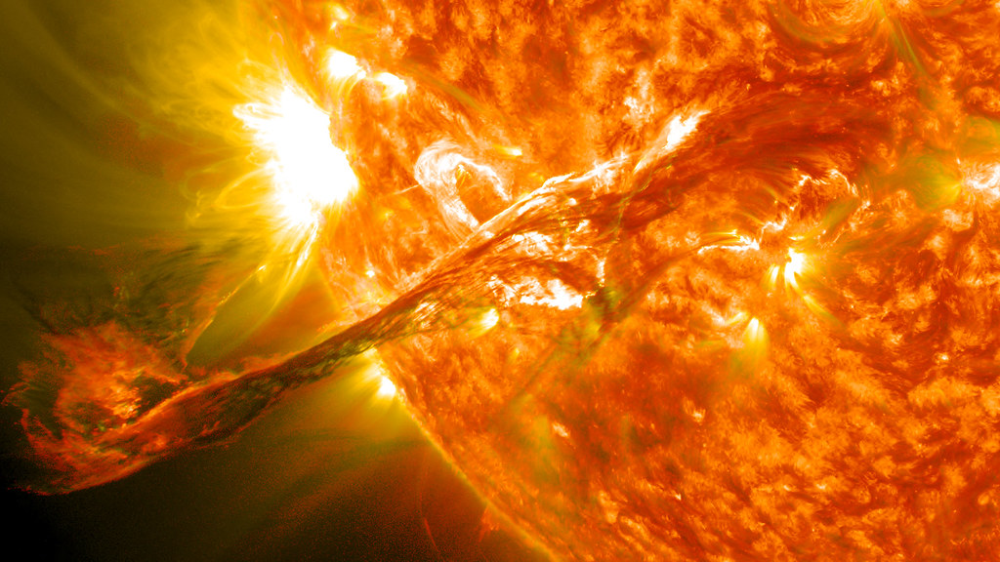
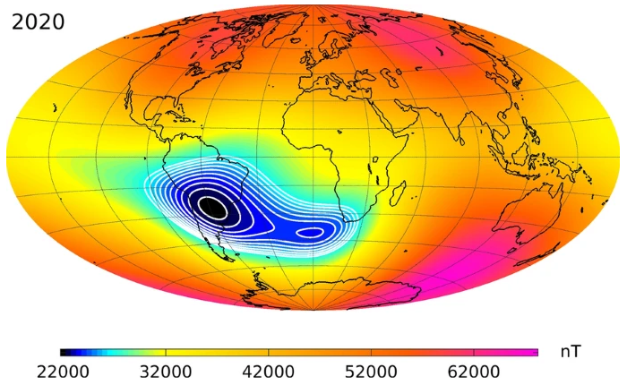

+++
date = '2026-05-07T10:03:28-03:00'
title = 'A Radiação Ionizante em Aplicações Aeroespaciais'
series = ["Seminários ITA"]
series_order = 4
tags = ["ITA", "Seminários", "Doutorado"]
+++

Continuando nos seminários da disciplina TE-301, a quarta apresentação foi feita pelo [Dr. Claudio Federico](http://lattes.cnpq.br/7719855389481526) do [Laboratório de Dosimetria Aeroespacial - LDA do IEAv](https://ieav.dcta.mil.br/),com o tema: 
## A Radiação Ionizante em Aplicações Aeroespaciais

Esse foi o resumo dado pelo professor:
*Resumo:
A radiação ionizante, seja de origem cósmica, ou originária de eventos de DQBRN (Defesa Química, Biológica, Nuclear ou Radiológica), ocasiona efeitos indesejáveis nos sistemas eletrônicos embarcados ou nos seres humanos expostos a estes ambientes. Na área espacial esse problema já é conhecido e é um dos grandes desafios para missões espaciais, principalmente missões de longa duração. Estudos e recomendações mais recentes ressaltam este risco também para a esfera dos sistemas embarcados e das tripulações de aeronaves em voo. O presente seminário aborda este panorama e traz uma visão dos estudos atualmente em curso no IEAv por meio do Projeto ERISA-D (Efeitos nocivos da Radiação Ionizante em tripulações, Sistemas Aeroespaciais e Defesa), apoiados pelo Laboratório de Dosimetria Aeroespacial (LDA) e pelo Laboratório de Radiações Ionizante (LRI) do IEAv, em parceria com o ITA.*

## Tópicos básicos de radiação comentados pelo professor

1) Cinturão de Van Allen
   
   Cinturões de Van Allen são regiões ao redor da Terra onde partículas carregadas vindas principalmente do Sol ficam presas pelo campo magnético terrestre. Essas partículas, como elétrons e prótons, se movem em espiral ao longo das linhas do campo magnético, formando zonas de alta radiação. Os cinturões ajudam a proteger a Terra de parte da radiação espacial, mas também representam risco para satélites, eletrônicos e astronautas em missões espaciais.
   
   _Fonte: https://picryl.com/media/magnetoplasmadynamcis-c65496_
2) Eventos de Partículas Solares

    Eventos de partículas solares são fenômenos em que o Sol libera grandes quantidades de partículas carregadas de alta energia, principalmente prótons e elétrons, geralmente após explosões solares. Essas partículas podem viajar pelo espaço e atingir a Terra, afetando satélites, comunicações, sistemas elétricos e aumentando a exposição à radiação para astronautas e voos em altas altitudes. São eventos importantes em engenharia espacial e clima espacial.
    
_Fonte: https://www.flickr.com/photos/gsfc/7931831962_

3) Acidentes Radiológicos

    Em Goiânia no ano de 1987 um aparelho de radioterapia abandonado foi desmontado e uma cápsula de césio-137 espalhou material radioativo pela cidade, causando contaminação, mortes e exposição de centenas de pessoas. Já o desastre de Fukushima Daiichi aconteceu após um terremoto e tsunami danificarem o sistema de resfriamento da usina nuclear, levando ao superaquecimento dos reatores e liberação de material radioativo. Ambos mostraram a importância da segurança, contenção e monitoramento em tecnologias envolvendo radiação.

## Efeitos Biológicos
Dose absorvida representa a quantidade de energia que a radiação deposita em um tecido ou material, sendo medida em gray (Gy). Quanto maior a dose absorvida, maior pode ser o efeito biológico da radiação, como destruição celular, queimaduras, mutações genéticas e aumento do risco de câncer. O efeito biológico depende não apenas da dose, mas também do tipo de radiação e do tecido atingido.

Por exemplo, um voo de São Paulo para a Europa pode expor os passageiros a uma dose de radiação ionizante equivalente a um exame de raio-x de tórax, mas a tripulação de aeronave pode receber uma dose 3 a 5 vezes maior devido à exposição prolongada em altitudes elevadas.

## Efeitos Eletrônicos
A radiação pode causar efeitos eletrônicos e alterar o funcionamento desses mesmos componentes, gerando falhas em circuitos, perda de dados e erros em satélites e equipamentos espaciais. Além disso, ocorre a Radiation-induced material degradation, onde a exposição contínua à radiação modifica propriedades físicas e químicas dos materiais, causando envelhecimento, fragilidade, perda de resistência e degradação de sensores, plásticos e semicondutores ao longo do tempo.

Exemplos de efeitos eletrônicos incluem: 
    Os Single-event effect acontecem quando partículas energéticas da radiação atingem componentes eletrônicos e alteram temporariamente seu funcionamento, podendo inverter bits de memória (“0” vira “1”), causar falhas de escrita e travamentos. Em satélites e sensores espaciais, isso também pode gerar ruídos e pontos brilhantes falsos em imagens, pois a radiação interfere diretamente nos detectores eletrônicos e nos circuitos de processamento.

A Anomalia do Atlantico Sul é uma área onde o campo magnético da Terra é mais fraco, principalmente sobre o Brasil e o Atlântico Sul. Nessa região, partículas energéticas dos cinturões de Van Allen conseguem chegar mais perto da superfície, aumentando a incidência de radiação em satélites e espaçonaves. Por isso, equipamentos eletrônicos que passam por essa área podem sofrer mais falhas, ruídos e efeitos eletrônicos causados pela radiação.

_Fonte: https://commons.wikimedia.org/wiki/File:SAA_2020.png_

## Projetos e Pesquisas

- ERISA-D (Efeitos nocivos da Radiação Ionizante em tripulações, Sistemas Aeroespaciais e Defesa)
- LDA (Laboratório de Dosimetria Aeroespacial)
  - Medição de dose de radiação ionizante em ambientes aeroespaciais
- LRI (Laboratório de Radiações Ionizante)
  - Irradiação de materiais e componentes eletrônicos para caracterização de efeitos da radiação ionizante
-  Space Farming
  - cultivo de plantas em ambientes de microgravidade e radiação ionizante

## Minha opinião

A palestra foi muito bem apresentada pelo Dr Claudio, onde mostrou a importância de se estudar os efeitos da radiação ionizante em ambientes aeroespaciais, tanto para a segurança de tripulações quanto para a proteção de sistemas eletrônicos. Ele explicou de forma clara os conceitos básicos relacionados à radiação, como os cinturões de Van Allen e os eventos de partículas solares, e destacou os riscos associados a esses fenômenos.

## Referências
- [IEAv](https://ieav.dcta.mil.br/)