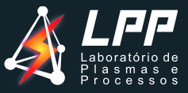

+++
date = '2026-03-31T14:01:09-03:00'
title = 'Laboratório de Plasmas e Processos'
series = ["Seminários ITA"]
series_order = 1
tags = ["ITA", "Seminários", "Doutorado"]
+++

Uma das disciplinas do meu doutorado esse ano no ITA é a TE-301, Seminários. Essa disciplina é coordenada pelo professor [Francisco Machado](http://lattes.cnpq.br/3088345359357221), com o intuito de apresentar grupos de pesquisa e trabalhos dentro do ITA. 

- [Primeira Apresentação: Laboratório de Plasmas e Processos](#primeira-apresentação-laboratório-de-plasmas-e-processos)
- [Meus comentários](#meus-comentários)
- [Referências](#referências)
  
## Primeira Apresentação: Laboratório de Plasmas e Processos

A primeira apresentação foi do [Laboratório de Plasmas e Processos](https://www.lpp.ita.br/), apresentada pelo professor [Andre Pereira](http://lattes.cnpq.br/0105707010434668) com o tema ***"Física de Plasmas: Superando Desafios da Tecnologia de Materiais"***

Esse foi o resumo dado pelo professor: 

*Resumo: A Física de Plasmas tem desempenhado um papel central no desenvolvimento de diversas tecnologias avançadas, com impacto direto em áreas estratégicas da Engenharia de Materiais, energia e meio ambiente. Nesta palestra, serão apresentados os princípios fundamentais da Física de Plasmas e será discutido como esses fenômenos têm sido explorados para o desenvolvimento de tecnologias inovadoras. Serão abordadas diferentes aplicações de plasmas em processos tecnológicos, com destaque para deposição de filmes finos, engenharia de superfícies, produção de recobrimentos funcionais e fabricação de sensores e dispositivos. Além disso, serão apresentados exemplos de aplicações em áreas emergentes, como destruição e gaseificação de resíduos, tratamento de efluentes sólidos e líquidos, processos baseados em ozônio e produção de combustíveis sustentáveis, incluindo rotas para geração de hidrogênio. A palestra também apresentará exemplos de pesquisas desenvolvidas no Laboratório de Plasmas e Processos (LPP) do Instituto Tecnológico de Aeronáutica (ITA), evidenciando como tecnologias a plasma podem contribuir para o avanço científico e para soluções tecnológicas em setores estratégicos como energia, meio ambiente e indústria aeroespacial.*

As linhas de pesquisa do LPP são:
1. Plasmas aplicados para síntese e aplicações de materiais ​
2. Plasmas aplicados para o setor aeroespacial
3. Energia, Sustentabilidade e Meio Ambiente
4. Bioengenharia e Agricultura

## Meus comentários

A palestra foi muito interessante, apresentando diversos processos e aplicações de plasmas, especialmente os desenvolvidos no LPP. 

Confesso que não conhecia o laboratório e foi interessante saber das aplicações de plasmas e o que o laboratório tem desenvolvido.

Destaco um exemplo que foi dado de aplicação de plasma em uma prótese de quadril, com o intuito de diminuir possíveis <u>infecções, melhorar a integração com o osso e aumentar a vida útil da prótese.</u> 
O exemplo foi interessante pois semanas antes dessa palestra minha mãe havia colocado essa mesma prótese.

## Referências
- [Laboratório de Plasmas e Processos](https://www.lpp.ita.br/)
