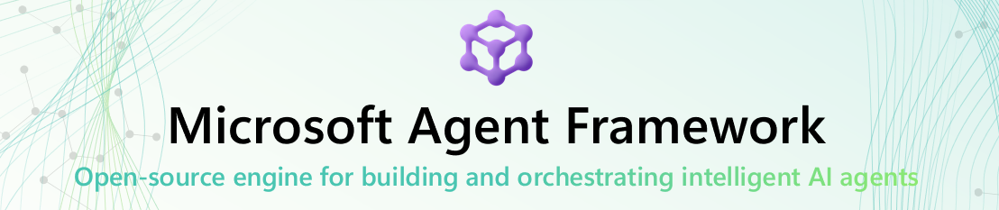

+++
date = '2026-04-03T14:03:29-03:00'
title = 'Microsoft Agent Framework Versão 1.0 Lançada'
series = ["Microsoft Agent Framework"]
series_order = 1
tags = ["MAF", "Agentes", "IA", "Microsoft"]

+++

Foi liberada ontem, dia 02/04/2026, a versão 1.0 do [Microsoft Agent Framework (MAF)](https://github.com/microsoft/agent-framework), um framework de código aberto para desenvolvimento, implementação e orquestração de agentes de IA usando Python e .NET. 

- [Proposta do MAF](#proposta-do-maf)
- [Série de Artigos](#série-de-artigos)
- [Referências](#referências)

## Proposta do MAF

MAF vem com a proposta PRO-CODE, ou seja, criação de agentes usando mais codificação, diferentes do MS Copilot 365, que seria voltado para usuários de negócio e do MS Copilot Studio com um foco em Power Users.

Também possui uma propostas de ser mais Enterprise-Ready, ou seja, com foco em segurança, privacidade e governança, o que seria um diferencial importante para adoção em empresas. 
E logicamente, mais integrado com o ecossistema Microsoft, como Azure, Microsoft 365, Foundry, etc.

## Série de Artigos

Vou criar uma série de posts para falar sobre o MAF, suas funcionalidades, arquitetura, integrações, casos de uso, etc, tanto quanto minha experiência usando o framework.

Vou criar também algumas implementações de exemplo usando o MAF, para mostrar como ele funciona na prática.

Sigam a série para acompanhar as novidades sobre o Microsoft Agent Framework!

## Referências
- [Microsoft Agent Framework (MAF) - GitHub](https://github.com/microsoft/agent-framework)
- [Microsoft Agent Framework (MAF) - Learning](https://learn.microsoft.com/en-us/agent-framework/overview/?pivots=programming-language-python)

