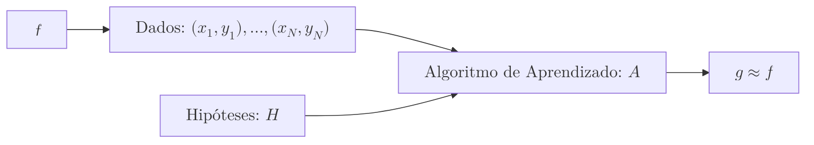

+++
date = '2026-04-10T13:07:47-03:00'
title = 'Curso Learning from Data - Caltech'
series = ["Machine Learning"]
series_order = 1
tags = ["Machine Learning", "IA", "ML"]
+++


Como um das minhas metas de revisão e estudos para 2026, está o curso Learning from Data, oferecido pela Caltech. O curso é ministrado pelo professor [Yaser Abu-Mostafa](https://www.eas.caltech.edu/people/yaser) e tem todo o seu material disponível online.
Eu o estou acompanhando pela plataforma [EDX](https://www.edx.org/learn/machine-learning/caltech-learning-from-data-introductory-machine-learning), onde ele é oferecido gratuitamente. 

O curso vai focar bastante na base para um bom conhecimento.

## Curso Learning from Data - Caltech
O curso é uma introdução ao aprendizado de máquina, e aborda os seguintes tópicos:

- Aula 1: O Problema de Aprendizado
- Aula 2: É Possível Aprender?
- Aula 3: O Modelo Linear I
- Aula 4: Erro e Ruído
- Aula 5: Treinamento versus Teste
- Aula 6: Teoria da Generalização
- Aula 7: Dimensão VC
- Aula 8: Dilema Viés-Variância
- Aula 9: O Modelo Linear II
- Aula 10: Redes Neurais
- Aula 11: Overfitting
- Aula 12: Regularização
- Aula 13: Validação
- Aula 14: Máquinas de Vetores de Suporte
- Aula 15: Métodos de Kernel
- Aula 16: Funções de Base Radial
- Aula 17: Três Princípios de Aprendizado
- Aula 18: Epílogo

## Epilogo

O professor Yaser começa pontuando que o curso falará de teoria matemática, porém focada na execução pratica de machine learning, ou seja, não serão cobertos muitos outros possíveis tópicos por questão de tempo.

### Mapa do Curso

#### Teoria
- Vapnik-Chervonenkis
- Viés-Variância
- Complexidade
- Inferência Bayesiana

#### Técnicas
**Modelos**
- Linear
- Redes Neurais
- Vetores de Suporte
- k-Nearest Neighbors
- Árvores de Decisão
- Processos Gaussianos
- Decomposição em Valores Singulares
- Modelos de grafos

**Métodos**
- Regularização
- Validação
- Agregação
- Processamento de dados

#### Paradigmas
- Supervisionado
- Não Supervisionado
- Reforço
- Ativo
- Online

## O Problema de Aprendizado

Essa matéria começa inicialmente com a definição do que é a essência do uso de machine learning. Ele usa o exemplo de um banco que quer aprovar um empréstimo, ou não para um cliente, baseado se ele é um bom pagador ou não.

A essência, segundo o professor, são as características que definem se um problema deve ser resolvido usando machine learning ou não. São elas:
- Um padrão existe
- Não é possível criar um função matemática de maneira simples
- Existem dados disponíveis para aprender o padrão


**Caso Real:** Já fui acionado para fazer uma analise de um possível problema à ser resolvido com machine learning, que ao conversar com o gestor da área, o mesmo tinha os dados, porem todos em livros físicos, ou seja até que os mesmo fossem digitalizados, o projeto de machine learning não poderia ser iniciado. Sendo assim,  a pergunta de se existem dados, é de extrema importância!


### Dados Disponíveis

O Banco possui as informações e histórico dos clientes, como idade, renda, salário, tempo de carteira de trabalho, débitos atuais, etc. Vamos chamar isso de dados de entrada, ou input, e matematicamente de \(x\). 

O banco também tem o histórico de clientes que pagaram ou não os empréstimos, ou seja, a resposta, ou output,  \(y\).

A junção desses dados, ou dataset, seria 
$$(x_1, y_1), (x_2, y_2), ..., (x_N, y_N))$$ onde \(N\) é o número de clientes.

### Um padrão existe

É de se imaginar que exista um padrão nesses dados, ou seja, uma função que baseado nas características dos clientes, consiga prever se o mesmo é um bom pagador ou não. Chamaremos isso de função alvo, ou target function, \(f\), tal qual 
$$f: X \rightarrow Y$$ sendo \(X\) todos as informações históricas do cliente e \(Y\) a resposta se o cliente é um bom pagador ou não.

### Não é possível criar um função matemática de maneira simples

Como não é possível criar uma função \(f\) simples, criamos uma hipótese, função
$$g: X \rightarrow Y$$ tal que seja uma aproximação de \(f\), ou seja, \(g \approx f\).

## O Fluxo do Aprendizado

E como fazemos para aprender a função \(g\)? O processo de aprendizado é o seguinte:

 Onde \(\mathcal{A}\) é o algoritmo de aprendizado, que será aprendido para tornar-se a função \(g\), e \(\mathcal{H}\) é o conjunto de hipóteses, ou seja, os modelos que serão testados para encontrar a melhor aproximação de \(f\).

 Por exemplo, dependendo do tipo de problema, usaremos modelos lineares, redes neurais, etc.

\(\mathcal{A}\) e \(\mathcal{H}\) são nossos componentes da solução.

Sendo que \(\mathcal{H} = \{h\}\), ou seja, é um conjunto de possíveis modelos, sendo \(g\) o melhor modelo encontrado, ou seja, \(g \in \mathcal{H}\).

Em termos mais simples, tenho varias hipóteses de modelos que podem funcionar, como regressão linear ou redes neurais. Eles seriam o h1, e h2, por exemplo. Uma vez que gerei um algoritmo baseado nesses modelos, e escolher o melhor deles, o modelo escolhido será chamado de \(g\).



No próximo artigo, vamos aprender como o algoritmo aprende baseado em um modelo de perceptron.



Comente abaixo o que achou do curso, da explicação e se tem interesse em acompanhar os próximos artigos sobre o assunto.

## Referências

- [Learning from Data - Caltech](https://work.caltech.edu/telecourse.html)

