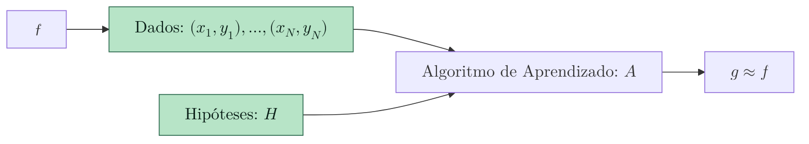
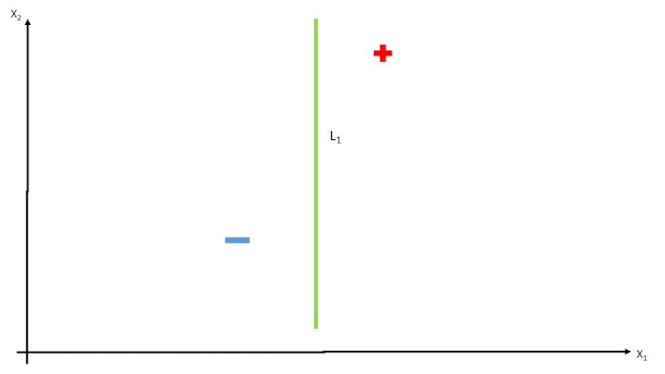

+++
date = '2026-04-30T15:45:15-03:00'
title = 'Curso Learning from Data - Exemplo de Perceptron'
series = ["Machine Learning"]
series_order = 2
tags = ["Machine Learning", "IA", "ML"]
+++


Continuando os estudos do curso Learning from Data, hoje vamos estudar o exemplo de Perceptron.

## Perceptron

Voltando ao nosso exemplo anterior, de um banco que quer classificar seus clientes em bons ou maus pagadores, temos os dados de entrada, ou as características dos clientes, sendo 
$$X = (x_1,...x_d)$$ , onde cada \(x_i\) representa um atributo diferente do cliente(idade, renda, histórico de crédito, etc.) 
e \(d\) o número de atributos.

Sendo assim, a formula do perceptron é dada por:
1) Aprova o crédito se: 
$$\sum_{i=1}^{d} w_i x_i > limite$$
2) Recusa o crédito se:
$$\sum_{i=1}^{d} w_i x_i < limite$$

Olhando com cuidado para formula, vemos que temos um novo conjunto de parâmetros, os pesos \(w_i\) e o limite, que são os parâmetros a serem aprendidos tendo em vista que os valores de \(x_i\) são os dados já existentes.

Os pesos \(w_i\) indicam a importância de cada atributo \(x_i\), quanto maior o peso mais importante o atributo, por exemplo, de repente o salário mensal do cliente terá um peso maior do que outros atributos.

Dito isso, a formula linear \(h \in H \), ou seja, um possível modelo de hipótese, é dada por:
$$h(x) = sign(\sum_{i=1}^{d} w_i x_i - limite)$$
sendo \(sign\) a função que retorna 1 se o valor for positivo e -1 se for negativo.
Positivo significa que o cliente é um bom pagador, e negativo significa que o cliente é um mau pagador.

Para facilitar a notação, vamos chamar o limite de \(w_0\) e adicionar um atributo \(x_0\) que é sempre igual a 1, ou seja, \(x_0 = 1\). Assim, a formula do perceptron fica:
$$h(x) = sign(\sum_{i=0}^{d} w_i x_i)$$

O Resultado é o mesmo do que a notação anterior, porem fica mais simples de escrever.

## O Algoritmo de Aprendizado

Relembrando o diagrama que comentamos no artigo anterior, temos no nossos Dados, as hipóteses, que acabamos de ver do perceptron, porem esses dois se juntam no algoritmo de aprendizado, que é o processo de encontrar os melhores pesos \(w_i\) para a função \(h\) do perceptron.

Sendo assim, o algoritmo irá de maneira arbitrária, gerar valores de \(w_i\) e testar a função \(h\), comparando o resultado com os dados de resposta \(y\), e tendo em vista que o resultado é linear, toda vez que temos os valores de \(w_i\) alterados, na verdade temos uma reta \(L\) desenhada no espaço de \(x\), como vemos na imagem abaixo.

Imagem: [Wikipedia Commons](https://commons.wikimedia.org/wiki/File:Perceptron_algorithm.gif)

Essa iteração acontece varias vezes até que encontre os melhores pesos para a função, sempre olhando os erros através da função 
$$Erro(h) = \frac{1}{N} \sum_{i=1}^{N} [h(x_i) \neq y_i]$$

## Resumo

Aprendemos nesse artigo um exemplo de modelo de hipótese, o perceptron, e como o algoritmo de aprendizado funciona para encontrar os melhores pesos \(w_i\) para a função \(h\).

No próximo artigo, vamos falar dos tipos de aprendizado, como o aprendizado supervisionado, não supervisionado e por reforço.

Se inscreva na newsletter para receber alertas para os próximos artigos sobre o assunto.

## Referências

- [Learning from Data - Caltech](https://work.caltech.edu/telecourse.html)
- [Wikipedia Commons](https://commons.wikimedia.org/wiki/File:Perceptron_algorithm.gif)